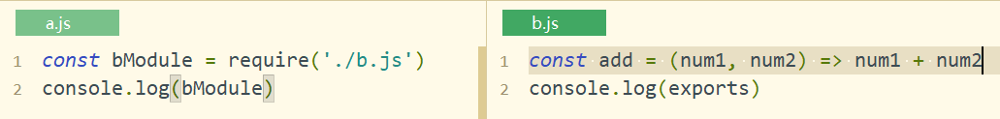
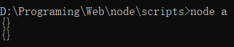

# Node 学习笔记

---

## 相关信息

> 视频地址：https://www.bilibili.com/video/BV1Ns411N7HU?from=search&seid=4890617616201409733
>
> github：https://github.com/haveadate
>
> 码云：https://gitee.com/haveadate
>
> email：haveadate@qq.com

## 相关概念

### 介绍

​		Node.js不是一门语言，也不是库、框架，Node.js是一个JavaScript运行时环境，简单点来说就是Node.js可以解析和执行JavaScript代码。以前的JS代码只能在浏览器中进行解析，现在有了Node.js，JS代码完全可以脱离浏览器来运行。

​		在浏览器中的JS，主要由ECMAScript（JS基础语法）+BOM（window……）+DOM（document……）三部分组成，而Node.js中的JS没有BOM、DOM，只有ECMAScript和一些Node提供的服务器级别的API（例如文件读写、网络服务的构建、网络通信、http服务器等等操作）组成。

### 特点

​		Node.js的特点：事件驱动、非阻塞I/O模型（异步）、轻量高效；

​		npm是Node.js的包管理工具，是世界上最大的开源库生态系统，绝大多数JS相关的包都存放在了npm上，这样做的目的是为了让开发人员更加方便的去下载使用包。

### 构建过程

​		值得一提的是，Node.js构建在Chrome V8引擎（JS代码解析工具）之上。解释：代码只是具有特定格式的字符串而已，引擎可以认识它，引擎可以将其解析和执行，Google Chrome的V8引擎是目前公认的解析执行JS代码最快的引擎，Node.js的作者把Google Chrome中的V8引擎移植出来，开发了一个独立的JS运行时环境。

### 作用

​		Node.js能做Web服务器后台、命令行工具(例如npm)。

### 参考书籍

- 《深入浅出Node.js》：偏理论，几乎没有任何实战性内容，对理解底层原理很有帮助；
- 《Node.js权威指南》：对Node.js的API进行讲解，也没有实战性内容；
- Node入门：https://www.nodebeginner.org/index-zh-cn.html；

## 通过简单案例了解Node.js

### 搭建简单的服务器并具有一定的响应

```js
const http = require('http')
const server = http.createServer()

// 监听客户端的请求
server.on('request', (request, response) => {
  switch (request.url) {
    case '/login':
      response.write('login.html')
      break
    case '/register':
      response.write('register.html')
      break
    default:
      response.write('bad request')
      break
  }
  response.end()
})

// 绑定端口号，启动服务器
server.listen(8848, () => console.log('server is running, access server with http://127.0.0.1:8848/'))
```

## 基础知识

### 使用命令行执行JS文件

**`node fileName.js`**，注意：

- JS文件名不能为node.js；
- node 后加上JS文件路径就行了，没必要使用cmd定位到JS文件所在目录；

### 核心模块

Node为JS提供了许多服务器级别的API，这些API绝大多数都被包装到了不同的核心模块中，例如文件操作相关的**`fs`**核心模块，http服务构建的**`http`**模块，**`path`**路径操作模块、**`os`**操作系统信息模块等等，详细的可查看官网API：http://nodejs.cn/api/http.html

### 模块系统

require是一个方法，它的作用就是用来**加载执行模块中的代码**的。在Node中，模块有**三**种：

- 具名的核心模块，例如fs、http；
- 用户自己编写的文件模块(.js文件，<u>同目录下的相对路径必须加**./**</u>)；
- 第三方模块

#### 特点

在Node中，没有全局作用域，只有模块作用域(即文件作用域)，外部访问不到内部，内部也访问不到外部(外部-内部概念，相对于require语句的位置而言)；

#### require方法的作用

##### 加载文件模块并执行里面的代码


##### 拿到被加载文件模块导出的接口对象

在每个文件模块中，都提供了一个对象：exports，默认是一个**空对象**，用于模块之间的通信。





<u>在node中，没有全局作用域，只有模块作用域</u>，要使用其它模块的方法/变量，只有通过exports：


## 服务器(http核心模块)

### 搭建简单的服务器

```javascript
// 导入http核心模块
const http = require('http')
// 创建一个服务器
const server = http.createServer()

// 对客户端的request请求作出响应
server.on('request', (req, res) => {
  res.end('Hello, Node.js')
})

// 设置端口号，启动服务器
const port = 8080
server.listen(8080, () => console.log('server is running, access to http://127.0.0.1:8080/'))
```

### 明确返回数据的编码方式

对于服务器而言，向客户端返回的数据默认格式是UTF-8，但是在浏览器中，如果没有明确指定Content-Type，那么<u>浏览器会默认按照客户端(电脑)的默认编码(通常为GBK即`GB2312`)去解析服务器返回的数据</u>，所以如果我们不设置Content-Type，那么在浏览器中看到服务器返回的中文就是乱码的。

所以，我们在**server.on**的回调函数中添加如下代码，明确(告诉)浏览器使用<u>指定编码</u>解析服务器返回的数据：

```javascript
response.setHeader('Content-Type', 'text/plain; charset=utf-8')
```

添加前的Header：


添加后的Header：


**注意：**

​		对于text/plain，是<u>指定浏览器以什么方式去解析服务器返回的数据</u>，例如：text/plain是指定以普通文本的方式解析返回的数据，text/html是指定以HTML文件的方式解析返回的数据。如果明确设置Content-Type，浏览器会默认按照<u>普通文本</u>去解析返回的数据。

​		查看不同文件类型对应于Content-Type请看这里https://tool.oschina.net/commons

#### 查看电脑默认编码方式

https://blog.csdn.net/zp357252539/article/details/79084480

### 实现Apache服务器的访问功能[通过文件url，直接访问文件]

和Apache服务器类似，所有需要访问的文件都放在一个统一的目录里，用户通过url即可访问：


```javascript
// 导入http核心模块
const http = require('http')
// 导入fs核心模块
const fs = require('fs')

// 创建一个服务器
const server = http.createServer()

// 对客户端的请求，服务器做相应的处理
server.on('request', (request, response) => {
	// 文件根目录
	const baseUrl = 'D:/Programming/Web/Test'
	
	// 默认显示index.html
	var url = request.url
	if (url === '/') {
		url = '/index.html'
	}	
	// 读取服务器文件，并传给客户端
	fs.readFile(baseUrl + url, (err, data) => {
		if (err) {
			// 若文件不存在
			response.end('404 not found.')
		} else {
			response.end(data)
		}
	})	
})

// 监听某个端口号，启动服务
server.listen(8080, () => console.log('服务已启动，URL: http://127.0.0.1:8080/'))
```

### 简洁的服务器搭建方式

```javascript
// 应用程序
// 把当前模块所有的依赖项都声明在文件模块最上面
const http = require('http')
const fs = require('fs')

http.createServer((req, res) => {
	res.end('服务器已收到请求')
}).listen(8080, () => {
	console.log('服务已启动，URL: http://127.0.0.1:8080/')
})
```

### 客户端请求过程[以后端渲染为例]

​		在客户端向服务器发起请求时，服务器将网页渲染好，发送给客户端。浏览器在收到 HTML 响应内容之后，就要开始从上到下依次解析，在解析过程中如果发现：link、script、img、iframe、video、audio等带有 src 或者 href(link) 属性标签(具有外链的资源)的时候，浏览器会自动对这些资源发起新的请求。

​		所以，对于后端渲染的网页，外链资源的地址**不要**像本地开发那样使用相对路径，而是应该以 **url** 的方式进行获取，例如服务器开放了 **public** 目录，所以请求路径都写成 `/public/xxx` 的形式(对于位于同一服务器的资源)，`/`  在这里就是表示根路径的意思，浏览器在请求时会自动把域名加上。

​		案例请见 `/example/feedback`

### 服务端重定向

```javascript
// 服务端重定向
res.statusCode = 302
res.setHeader('Location', '/')
res.end()
```

具体效果，当时没有弄成功，后面可以再尝试一下。

## 文件操作(fs核心模块)

### `fs.readFile(path[, options], callback)`

#### 不指定options(路径 path 可以省略 ./，异步)

```javascript
// 导入文件操作核心模块(fs)
const fs = require('fs')

// 读取文件
fs.readFile('../index.html', (err, data) => {
	if (err) {
		// 文件读取错误
		console.log(err)
	} else {
		// 文件读取成功(如果没有指定字符编码[options]，则返回原始的 buffer)
		console.log(data)
	}
})
```

输出结果如下：

```shell
D:\Programming\Web\Test\js>node fileOperate
<Buffer 3c 21 44 4f 43 54 59 50 45 20 68 74 6d 6c 3e 0d 0a 3c 68 74 6d 6c 20 6c 61 6e 67 3d 22 7a 68 22 3e 0d 0a 09 3c 68 65 61 64 3e 0d 0a 09 09 3c 6d 65 74 ... 238 more bytes>
```

#### 指定options

```javascript
// 导入文件操作核心模块(fs)
const fs = require('fs')

// 读取文件
fs.readFile('../index.html', 'utf8', (err, data) => {
	if (err) {
		// 文件读取错误
		console.log(err)
	} else {
		// 文件读取成功(指定字符编码[options]为UTF-8)
		console.log(data)
	}
})
```

输出结果如下：

```shell
D:\Programming\Web\Test\js>node fileOperate
<!DOCTYPE html>
<html lang="zh">
        <head>
                <meta charset="UTF-8">
                <meta name="viewport" content="width=device-width, initial-scale=1.0">
                <meta http-equiv="X-UA-Compatible" content="ie=edge">
                <title></title>
        </head>
        <body>
                <h3>Hello, World</h3>
        </body>
</html>
```

### `fs.readdir(path[, options], callback)`

简单读取指定目录下的文件和目录：

```javascript
// 导入文件操作核心模块(fs)
const fs = require('fs')

// 读取文件目录
fs.readdir('D:/Programming/Web/Test', (err, list) => {
	if (err) {
		// 目录不存在
		console.log(err)
	} else {
		// 目录读取成功
		console.log(list)
	}
})
```

输出结果如下：

```shell
D:\Programming\Web\Test\js>node fileOperate
[ 'css', 'file', 'img', 'index.html', 'js', 'less' ]
```

## URL解析(url核心模块)

​		一般的，对于客户端的请求，通过 **if-else** 结构都能够进行相应判断并响应，但是对于表单提交的数据更加复杂，则需要使用 `url` 核心模块：

```javascript
// 导入url解析核心模块(url)
const url = require('url')

// 通过parse方法解析url
const urlObj = url.parse('http://www.baidu.com:8080/login.html?account=123456&password=000000')
// 打印转换结果
console.log(urlObj)
```

结果如下：

```shell
Url {
  protocol: 'http:',
  slashes: true,
  auth: null,
  host: 'www.baidu.com:8080',
  port: '8080',
  hostname: 'www.baidu.com',
  hash: null,
  search: '?account=123456&password=000000',
  query: 'account=123456&password=000000',
  pathname: '/login.html',
  path: '/login.html?account=123456&password=000000',
  href: 'http://www.baidu.com:8080/login.html?account=123456&password=000000'
}
```

如果 `url.parse()` 方法第二个参数为 `true`，则结果中的 `query` 属性会被转换成对象。

```shell
Url {
  protocol: 'http:',
  slashes: true,
  auth: null,
  host: 'www.baidu.com:8080',
  port: '8080',
  hostname: 'www.baidu.com',
  hash: null,
  search: '?account=123456&password=000000',
  query: [Object: null prototype] { account: '123456', password: '000000' },
  pathname: '/login.html',
  path: '/login.html?account=123456&password=000000',
  href: 'http://www.baidu.com:8080/login.html?account=123456&password=000000'
}
```

## 模块系统

### CommonJS 模块规范

在 Node 中对的 JavaScript 还有一个很重要的概念：模块系统。

- 模块作用域；
- 使用 require 方法用来加载模块；
- 使用 exports 接口对象用来导出模块中的成员；

### 模块导出成员

​		就如我们前面所了解的那样，每个模块中默认都有个 exports 对象，用以实现模块之间的“通信”。

```javascript
// module_d.js
const ID = '9527'
exports.id = ID

// module_c.js
const moduleD = require('./module_d')
console.log(moduleD.id)
```

​		如果只想导出 `module_d.js` 中的 ID 且不像上面那样挂载到 exports 对象中如何处理？直接将 ID 赋值给 exports？

```javascript
// module_d.js
const ID = '9527'
exports = ID

// module_c.js
const moduleD = require('./module_d')
console.log(moduleD)

// result
// {}
```

​		我们发现，这样不行，无论如何，exports 都只能是个对象。

#### 导出多个成员

​		方式和我们前面了解的一样，通过挂载到 **exports** 中的方式实现：

```javascript
// module_d.js
const name = '张三'
const age = 18
const sex = '男'

exports.name = name
exports.age = age
exports.sex = sex

// module_c.js
const moduleD = require('./module_d')
console.log(moduleD)

// result
// { name: '张三', age: 18, sex: '男' }
```

#### 导出单个成员

​		Node 中，每个模块内部都有一个自己的 **module** 对象，在该 module 对象中，有个成员叫 exports。

```javascript
// module_d.js
const ID = '9527'
// 只能导出一个，多次导出，后者会覆盖前者
module.exports = ID

// module_c.js
const moduleD = require('./module_d')
console.log(moduleD)
```

### 底层原理

​		究竟 **exports** 和 **module.exports** 有什么区别呢？底层中，在刚开始有这么一段代码：`var exports = module.exports`，**最终**其它模块通过 require 获取时，获取的是 **module.exports**。也就是说，在中途修改 **exports** 的指向，最终都不会影响 **module.exports**，**exports** 出现的原因是因为 **module.exports** 不够简洁，内容相对而言更加冗长。

```javascript
// module_d.js
exports.age = 12
exports = { age: 20 }

// module_c.js
const moduleD = require('./module_d')
console.log(moduleD)

// result
// { age: 12 }
```

### require加载规则

#### 优先从缓存加载

```javascript
// module_c.js
const module_d = require('./module_d')
const module_e = require('./module_e')
console.log('in module_e', module_e)

// module_d.js
console.log('module d loaded!')
const module_e = require('./module_e')
console.log('in module_d', module_e)

// module_e.js
console.log('module e loaded!')
// 导出的方法
module.exports = function(a, b) {
	return a + b
}
```

运行 **module_c.js**：

```shell
D:\Programming\Web\Test\js>node module_c
module d loaded!
module e loaded!
in module_d [Function]
in module_e [Function]
```

​		从结果中我们可以看出：由于在 **module_d** 中已经加载过 **module_e** 了，所以在 **module_c** 中不会重复加载 **module_e**(不会执行 module_e 中的代码)就可以拿到 module_e 导出的对象，这样做的目的是通过缓存加载，避免重复加载代码，从而提高模块加载效率。

#### require方法参数——用户自定义模块

路径形式的模块：

- **./**：当前目录，不可省略；
- **../**：上一级目录，不可省略；
- **/xx**：表示当前文件模块所属磁盘根路径(例如C盘，D盘)[几乎不用]；
- **d:/xxx**：某个盘符下的路径[几乎不用]；

#### require方法参数——核心模块

​		对于require方法中的参数，除了用户**自定义的模块(文件)**以外，还有**核心模块**、**第三方模块**。事实上，核心模块也是一个个的文件，只不过被编译到了Node环境二进制文件中，如果要查看代码(Node开源)，github：

- https://github.com/nodejs/node
  + https://github.com/nodejs/node/tree/master/lib

#### require方法参数——第三方模块

第三方模块使用事项：

- 凡是第三方模块通常(~~都必须~~，**npm** 只是一个下载工具而已，只要理清了依赖，粘贴复制文件也可以使用第三方模块)通过 **npm** 来下载；
- 使用时，通过 **require('包名')** 的方式来进行加载使用；
- 不可能有任何一个第三方包和核心模块的名字是一样的；
- 第三方模块既不是核心模块，也不是路径形式的模块，加载时：
  1. 先找到当前文件所处目录中的 **node_modules** 目录[以**art-template(模板引擎)**为例]；
  2. 找到 **node_modules/art-template** 目录；
  3. 找到第三方目录下的 **package.json** 文件；
  4. 找到 **.json** 文件中的 **main** 属性，该属性记录了 **art-template** 的入口模块；
  5. 然后加载使用第三方模块，实际上最终加载的还是文件；

如果 **package.json** 文件不存在或者 **main属性** 指定的入口模块不存在，则 **node** 会自动查找该目录下的 **index.js** 文件作为入口模块，也就是说 **index.js** 会作为一个默认备选项。

如果以上任何一个条件都不成立，则会进入上一级目录中的 **node_modules** 目录查找，如果上一级还没有，则继续往上级找，直到当前磁盘根目录还找不到，则会报错：`Cannot find module 'xxx'`。

注意：我们项目中有且只有一个 **node_modules**，放在项目根目录中，这样的话项目中所有的子目录中的代码都可以加载到第三方包，不会出现多个 **node_modules** 目录。

更多底层知识，参考：

- blog：https://www.infoq.cn/article/nodejs-module-mechanism/；
- book：《深入浅出Node.js》模块系统章节；

### npm 和 package.json

​		`npm` 即 **node package manager**，是 **node** 包管理工具。

快捷操作：npm 以空格分隔，安装多个第三方模块：

```shell
npm i art-template jquery better-scroll
```

​		建议每一个项目都要有一个 `package.json` 文件(包描述文件，就像产品说明书一样)，这个文件可以通过 `npm init` 的方式自动初始化出来：

```shell
D:\Programming\Web\Test>npm init
This utility will walk you through creating a package.json file.
It only covers the most common items, and tries to guess sensible defaults.

See `npm help init` for definitive documentation on these fields
and exactly what they do.

Use `npm install <pkg>` afterwards to install a package and
save it as a dependency in the package.json file.

Press ^C at any time to quit.
package name: (test) test
version: (1.0.0) 0.0.1
description: 学习知识的代码书写区域，例如学习Less，Node等知识点
entry point: (index.js) main.js
test command:
git repository:
keywords: learn
author: haveadate@qq.com
license: (ISC) MIT
About to write to D:\Programming\Web\Test\package.json:

{
  "name": "test",
  "version": "0.0.1",
  "description": "学习知识的代码书写区域，例如学习Less，Node等知识点",
  "main": "main.js",
  "scripts": {
    "test": "echo \"Error: no test specified\" && exit 1"
  },
  "keywords": [
    "learn"
  ],
  "author": "haveadate@qq.com",
  "license": "MIT"
}


Is this OK? (yes) yes
```

生成的 **.json** 文件如上，现在生成了两个文件：


​		就目前来讲，最有的是 `package.json` 文件中的 `dependencies` 选项，可以用来帮我们保存第三方包的依赖信息，就算 `node_modles` 删除了也不用担心，我们只需要使用 `npm install` 命令，就会把 `package.json` 中的 `dependencies` 中所有的依赖项都下载回来，不过请注意：

- 建议每个项目的根目录都要有个 `package.json` 文件；
- 建议执行 `npm install` 命令安装第三方模块时，都要加上 `--save` 这个**选项**，目的一是用来保存依赖项的信息(自动添加至 package.json 文件的 `dependencies` 选项中)，如果不添加该选项，则**~~不会~~**在 `package.json` 文件中自动添加【现在也能添加】；

#### npm 网站

> https://www.npmjs.com/

#### npm 命令行工具

​		npm 的第二层含义就是一个命令行工具，只要安装了 node 就已经安装了 npm。npm 同样有版本的概念，通过以下命令查看 npm 版本：

```shell
npm --version
```

​		通过以下命令升级 npm：

```shell
npm install --global npm
```

#### npm 常用命令

- **npm init**：生成 package.json 文件；
  + npm init --yes（npm init -y）：跳过向导，快速生成；
- **npm intall（npm i）**：一次性把 package.json 文件 dependencies 选项中的依赖项全部安装；
- **npm install 包名（npm i 包名）**：只下载（现在也能添加安装信息到 package.json 文件中的 dependencies 选项）；
- **npm install --save 包名（npm i -S 包名）**：下载并且保存依赖项（添加安装信息到 package.json 文件中的 dependencies 选项中）；
- **npm uninstall 包名（npm un 包名）**：只删除，如果有依赖项会依然保存；
- **npm uninstall 包名 --save（npm un 包名 -S）**：删除的同时也会把依赖信息去除；、
- **npm help**：查看使用帮助；
- **npm 命令 --help**：查看某一指令的使用帮助，例如忘记了 uninstall 命令的简写可通过 `npm uninstall --help` 查看使用帮助；

#### 解决 npm 被墙问题

​		npm 存储包文件的服务器在国外，有时候会被墙速度很慢，对于此，淘宝开发团队把 npm 在国内做了一个备份：https://developer.aliyun.com/mirror/NPM?from=tnpm（https://npm.taobao.org/）

安装淘宝的 cnpm：

```shell
# 在任意目录执行都可以
# --global 表示安装到全局，而非当前目录
npm install --global cnpm
```

在接下来的使用中，将之前的 `npm` 命令替换成 `cnpm` 即可。

举个例子：

```shell
# npm 默认走国外 npm 服务器，速度比较慢
npm install jquery

# 使用 cnpm 就会通过淘宝的服务器来下载，比较快
cnpm install jquery
```

如果不想安装 `cnpm` 又想使用淘宝的服务器来下载：

```shell
npm install jquery --registry=https://registry.npm.taobao.org
```

但是每一次手动这样加参数很麻烦，所以我们可以把这个选项加入配置文件中：

```shell
npm config set registry https://registry.npm.taobao.org

# 查看 npm 配置信息
npm config list
```

通过以上命令的配置，以后所有的 `npm install` 都会默认通过淘宝的服务器来下载。

## Express框架

​		原生的 **http** 核心模块在某些方面表现不足以应对我们的开发需求，所以我们需要使用框架来加快我们的开发效率。框架的目的就是提高效率，让我们的代码更高度统一。在 Node 中，有很多 Web 开发框架，我们这里以学习 **express** 框架(创始人 github：https://github.com/tj)为主。

### 起步

#### 安装

```shell
# npm install express --save
npm i express -S
```

#### 输出 Hello, World

```javascript
// 引入第三方模块——express
const express = require('express')

// 创建app
const app = express()

// 监听默认请求
app.get('/', (req, res) => {
	res.send('Hello, World!')
})

// 绑定端口号，启动服务
app.listen(8080, () => {
	console.log('server is running...')
	console.log('URL: http://127.0.0.1:8080/')
})
```

### 修改代码后自动重启

​		我们这里可以使用第三方命令行工具：`nodemon`、`supervisor`来帮我们解决频繁修改代码重启服务器问题。

​		无论是 `nodemon` 还是 `supervisor`，都是基于 Node.js 开发的第三方命令行工具，我们要使用必须独立安装：

```shell
# 安装 nodemon
npm i nodemon --global

# 安装 supervisor
npm i supervisor --global

# 查看是否安装成功
nodemon --version
```

安装完毕之后，使用：

```shell
# app.js 可省略 .js
node app

# 使用 nodemon
nodemon app

# 使用 supervisor
supervisor app
```

### 基本路由

get：

```javascript
// 当客户端以 GET 方法请求 / 的时候，执行对应的处理函数
app.get('/', (req, res) => {
	res.send('Got a GET request.')
})
```

post：

```javascript
// 当客户端以 POST 方法请求 / 的时候，执行对应的处理函数
app.post('/', (req, res) => {
	res.send('Got a POST request.')
})
```

### 静态服务

对于前面通过底层代码开放出来的资源做法，express 框架也对此进行了封装：

```javascript
// 请求路径必须以第一次参数开头，访问第二个参数所指目录中的文件
app.use('/lvdm/', express.static('./public/'))
```


外部可访问的 url 表现为：http://127.0.0.1:8080/lvdm/less/index.less

**注意**：第一个参数是任意指定的，相当于一个别名，但为了避免混淆，最好和目录名称保持一致。

若不指定第一参数，即表示没有别名，可以直接访问，此时：

```javascript
app.use(express.static('./public/'))
```

外部可访问的 url 表现为：http://127.0.0.1:8080/less/index.less

### 在 Express 中配置使用 `art-template` 模板引擎

**art-template**：

​		**github** 仓库：https://github.com/aui/art-template；

​		中文官方文档：https://aui.github.io/art-template/zh-cn/index.html；

#### 安装

```shell
# npm install art-template --save
npm i art-template -S
# ...
npm i express-art-template -S
```

or

```shell
npm i -S art-template express-art-template
```

#### 配置

```javascript
app.engine('art', require('express-art-template'))
```

​		第一个参数表示：当渲染以 `.art` 结尾的文件时，使用 art-template 模板引擎；express-art-template 是专门用在 Express 中，把 art-template 整合到 Express 中的；虽然外面不需要加载 art-template 但是必须安装，原因就在于 express-art-template 依赖了 art-template。

#### 使用

```javascript
app.get('/404', (req, res) => {
  res.render('404.art')
})
```

​		Express 为 response(res) 对象提供了一个方法——render。render 方法默认是不可用的，但是如果配置了模板引擎就可以使用。`res.render('html 模块名', {模板数据})`：第一个参数不能写路径，默认会去项目中的 `views` 目录查找该模板文件，也就是说 Express 框架有个约定，默认地认为开发人员把所有视图文件(`.html`)都放在了 `views` 目录中。

#### 优化

​		当然，我们可以通过直接修改 **views** 目录中的 **html** 文件，将他们的后缀名从 **.html** 修改成 **.art** 后缀就可以使用 **art-template**了，但是这样反复操作很不方便，编译器代码高亮也会受影响。如何解决呢？细心一点就会发现，在配置过程中，将 `app.engine()` 方法第一个参数修改成 `'html'`，就可以直接在 `.html` 中使用 `art-template`。

​		同样地，也可以通过以下代码修改视图文件的存储目录，注意第一个参数为 `views`:

```javascript
app.set('views', 视图文件指定存储路径)
```

### 后端获取请求参数(例如表单)

#### get 请求

```javascript
app.get('/xxx', (req, res) => {
	console.log(req.query) // { name: '张三', message: '今天天气不错' }
  // other code
})
```

**注意**：`req.query` 只能用来获取 `GET` 请求的参数。

#### post请求

​		Express 框架并没有直接提供获取 POST 请求参数的方法，需要安装中间件，也就是第三方模块 —— `body-parser`（http://expressjs.com/en/resources/middleware/body-parser.html）：

安装：

```shell
npm i body-parser -S
```

配置：

```javascript
app.use(bodyParser.urlencoded({ extended: false }))
app.use(bodyParser.json())
```

使用：

```javascript
app.post('/xxx', (req, res) => {
	console.log(req.body) // { name: '张三', message: '今天天气不错' }
  // other code
})
```

### 后端路由跳转

​		【自己归纳总结】指前端跳转除了 `a` 标签跳转页面以外都是通过后端实现的跳转，表单提交都是使用最原始的方式(表单的 `action` 属性)：

#### 原生

```javascript
res.statusCode = 302
res.setHeader('Location', '/')
```

#### Express 框架

```javascript
res.redirect('/')
```

### 路由模块提取


## MongoDB

​		官方：https://www.mongodb.com/

​		菜鸟教程：https://www.runoob.com/mongodb/mongodb-tutorial.html

### 关系型数据库和非关系型数据库

​		关系型数据库就是表与表之间存在关系的数据库，例如常见的：MySQL、SqlServer、Oracle等数据库；相对而言，非关系型数据库(NoSQL：Not Only SQL)更加灵活，表与表之间没有关系，不需要操作之前设计表结构。值得一提的是，MongoDB 是所有非关系型数据库中最像关系型数据库的数据库。

### 基本概念

和其它关系型数据库相比，MongoDB 数据库在许多方面都有所区别：

- **概念上**：MongoDB 有数据库、集合、文档等概念，分别与传统关系型数据库的数据库、数据表、数据记录表示统一含义；
- **结构上**：MongoDB 非常灵活，不需要像 MySQL、Sql Server 等传统关系型数据库一样，MongoDB 不需要事先创建数据库，设计表结构，只需要在插入数据的时候，往哪个数据库哪个集合操作就可以了，创建数据库、集合等操作都由 MongoDB 帮你完成，同时 MongoDB 文档结构很灵活，没有任何限制；

MongoDB 数据库、集合、文档表现形式为：

```javascript
{
	// 系统数据库 admin
	admin: { 
		// ...
	},
	// other system database here.
	// 业务学校数据库
	school: {
		// 学生集合
		students: [
			{ name: '张三', age: 20 },
			{ name: '李四', age: 22 },
			{ name: '王五', age: 21 },
			// ...
		]
	},
	// ...
}
```

它们的表现形式也很熟悉，为 JS 对象、数组的形式。

### 安装

​		过程大致为：下载 -> 安装 -> 配置环境变量[将 `bin` 目录地址放到 Path 环境变量中就可以了] -> 命令查看是否安装成功。命令查看方式：

```shell
C:\Users\haveadate>mongod --version
db version v4.4.2
Build Info: {
    "version": "4.4.2",
    "gitVersion": "15e73dc5738d2278b688f8929aee605fe4279b0e",
    "modules": [],
    "allocator": "tcmalloc",
    "environment": {
        "distmod": "windows",
        "distarch": "x86_64",
        "target_arch": "x86_64"
    }
}
```

### 启动/关闭数据库

启动：

```shell
# MongoDB 默认使用执行 mongod 命令所处盘符目录下的 /data/db 作为自己的数据存储目录
# 所以，在第一次执行该命令之前，需要自己手动创建对应的目录
mongod
```

如果想要修改默认的数据存储目录，在每次执行时：

```shell
mongod --dbpath=数据存储目录路径
```

关闭：

```shell
# 1. 在开启服务的控制台直接 Ctrl + C 退出；
# 2. 直接关闭启动 MongoDB 的命令行窗口；
```

### 连接/退出数据库

连接：

```shell
# 该命令默认连接本机的 MongoDB 服务
mongo
```

退出：

```shell
# 在连接状态命令行窗口中输入 exit 退出连接
exit
```

### 基本命令

- `show dbs`：查看所有数据库；
- `db`：查看当前操作的数据库；
- `use 数据库名`：切换到指定的数据库，如果没有则会新建；
- `db.tableName.insertOne(obj)`：向表中插入一条数据，如果表不存在，则创建它；例如：`db.students.insertOne({"name": "张三"})`；
- `show collections`：查看查看数据库中的所有表格(集合)；
- `db.tableName.find()`：查看表格中的数据；

### 在 Node 中操作 MongoDB

#### 使用官方的 `mongodb` 包

相关网页：

- npm：https://www.npmjs.com/package/mongodb
- github：https://github.com/mongodb/node-mongodb-native

总的来说，官方 `mongodb` 包比较**原生、底层**，实际开发不用它。

#### 使用第三方 `mongoose` 包

​		`mongoose` 基于 MongoDB 官方的 `mongodb` 包进行了封装，是业务开发常用的一个第三方包:

- 官网：https://mongoosejs.com/
- 官方指南：https://mongoosejs.com/docs/guide.html
- 官方 API 文档：https://mongoosejs.com/docs/api.html

安装：

```shell
npm i mongoose [-S]
```

使用：

```javascript
const mongoose = require('mongoose')

// 连接 MongoDB 数据库
// 该数据库不需要事先创建，如果没有，则在向集合中插入文档时，MongoDB 会自动帮你创建
mongoose.connect('mongodb://localhost:27017/lvdm', {
	useNewUrlParser: true,
	useUnifiedTopology: true
});

// 创建一个数据模型，也就是设计一个 cats 表置于 lvdm 数据库中
// MongoDB 是动态的，非常灵活，只需要在代码中设计数据库即可
// mongoose 这个包可以让设计编写过程变得非常简单
// 以下代码是让 lvdm 数据库添加一个表 cats，表结构有个属性 name
const Cat = mongoose.model('Cat', {
	name: String
});

// 创建一个实例
const cat = new Cat({
	name: 'Tom'
});
// 持久化保存 Cat 实例
cat.save().then(() => console.log('meow'));
```

### mongoose 使用指南

#### 设计 Schema 发布 Model

```javascript
// 引入 MongoDB 第三方操作模块 mongoose
const mongoose = require('mongoose')
// 获取 mongoose 架构
const Schema = mongoose.Schema

// 1. 连接数据库[事前不必存在，若不存在，MongoDB 会帮我们创建]
mongoose.connect('mongodb://localhost:27017/college')

// 2. 设计文档结构(也就是我们熟悉的表结构)
// 字段名称就是表结构中的属性名称
// 约束的目的是为了保证数据的完整性，不要有脏数据
const stuSchema = new Schema({
	stuName: {
		type: String,
		required: true // 进行约束：该字段必须有
	},
	stuGender: {
		type: Boolean,
		required: true
	},
	stuEmail: {
		type: String
	}
})

// 3. 将文档结构发布为模型
// mongoose.model 方法就是用来将一个架构发布为 model
// 第一个参数：传入一个首字母大写单数名词用来表示集合名称
// 		mongoose 会自动将大写名词字符串生成小写复数集合名称
// 		例如这里，Student 会变成 students
// 第二个参数：架构(Schema)
// 返回值：模型构造函数
const Student = mongoose.model('Student', stuSchema)
```

#### 增加数据

```javascript
// 增加数据
const student = new Student({
	stuName: '张三',
	stuGender: true,
	stuEmail: 'admin@qq.com'
})
// 保存至数据库
student.save().then(data => console.log(data))
```

结果如下：

```shell
(node:18736) DeprecationWarning: current URL string parser is deprecated, and will be removed in a future version. To use the new parser, pass option { useNewUrlParser: true } to MongoClient.connect.
(node:18736) DeprecationWarning: current Server Discovery and Monitoring engine is deprecated, and will be removed in a future version. To use the new Server Discover and Monitoring engine, pass option { useUnifiedTopology: true } to the MongoClient constructor.
{
  _id: 5fed3b0974622e4930973c89,
  stuName: '张三',
  stuGender: true,
  stuEmail: 'admin@qq.com',
  __v: 0
}
```

#### 删除数据

**deleteOne**：删除一条数据

```javascript
// 删除一条指定条件的数据
Student.deleteOne({ stuName: '张三' }).then(data => console.log(data))
```

```shell
# 删除返回结果
{ n: 1, ok: 1, deletedCount: 1 }
```

**deleteMany**：删除多条数据

```javascript
// 删除多条指定条件的数据
Student.deleteMany({ stuGender: true }).then(data => console.log(data))
```

```shell
# 删除返回结果
{ n: 2, ok: 1, deletedCount: 2 }
```

#### 查找数据

**find()**:

<u>查找集合所有数据：</u>

```javascript
Student.find().then(data => console.log(data))
```

结果如下：

```shell
[
  {
    _id: 5fed3b0974622e4930973c89,
    stuName: '张三',
    stuGender: true,
    stuEmail: 'admin@qq.com',
    __v: 0
  },
  {
    _id: 5fed3be0ce8a8640848fa28a,
    stuName: '李四',
    stuGender: false,
    stuEmail: 'lisi@qq.com',
    __v: 0
  }
]
```

<u>根据条件查找：</u>

```javascript
// 查找性别为男的数据（true: 男，false: 女）
Student.find({ stuGender: true }).then(data => console.log(data))
```

结果如下：

```shell
[
  {
    _id: 5fed3b0974622e4930973c89,
    stuName: '张三',
    stuGender: true,
    stuEmail: 'admin@qq.com',
    __v: 0
  }
]
```

从上面代码中我们可以看出，通过 `find()` 方法进行查找时，无论是否有条件，返回结果都是一个数组。与之对应的 `findOne()` 方法则只取查找结果第一条数据。

**findOne()**:

```javascript
// 查找第一条数据
Student.findOne().then(data => console.log(data))
```

结果如下：

```shell
{
  _id: 5fed3b0974622e4930973c89,
  stuName: '张三',
  stuGender: true,
  stuEmail: 'admin@qq.com',
  __v: 0
}
```

根据条件查找同样如此，只返回查找结果中第一条文档。

#### 修改数据

**findByIdAndUpdate**:

```javascript
// 根据 id 修改数据
// 参数1：id，参数2：需要修改的内容
Student.findByIdAndUpdate('5fed3be0ce8a8640848fa28a', {
	stuGender: true
}).then(data => console.log(data))
```

**updateOne**:

```javascript
// 根据指定条件修改第一条数据
Student.updateOne({ stuName: '李四' }, { stuEmail: 'haveadate@qq.com' }).then(data => console.log(data))
```

```shell
# 修改返回结果
{ n: 1, nModified: 1, ok: 1 }
```

**updateMany**：方式和 updateOne 一样，修改对象是对所有选中数据进行修改。

## MySQL

### 安装

```shell
# [] 表示可要可不要，无关紧要
npm i mysql [-S]
```

### 使用

```javascript
const mysql = require('mysql')

// 1. 创建连接
const connection = mysql.createConnection({
	host: 'localhost',
	user: 'root',
	password: '000000',
	database: 'college'
})

// 2. 连接数据库
connection.connect()

// 3. 执行数据操作
connection.query('SELECT * FROM STUDENTS', (error, results, fields) => {
	if (error) throw error
	console.log('The solution is:')
	console.log(results)
})

// 4. 关闭连接
connection.end()
```

结果如下：

```shell
The solution is:
[
  RowDataPacket { STU_ID: '20173101', STU_NAME: '张三', STU_AGE: 18 },
  RowDataPacket { STU_ID: '20173102', STU_NAME: '李四', STU_AGE: 20 },
  RowDataPacket { STU_ID: '20173103', STU_NAME: '王五', STU_AGE: 19 }
]
```

### 总结

​		Node 操作 MySQL 数据库并没有像操作 MongoDB 那样对于不同操作分别对应不同的方法，在 Node 操作 MySQL 时，使用 `query` 方法即可执行 MySQL 数据库的**增**、**删**、**查**、**改**操作。

## 代码风格

​		在多人协同开发任务中，往往要求代码符合一定的规范。有些人的代码尽管都能运行，但是不是那么美观，目前社区有两种代码规范普遍受到大家的认同：

-  JavaScript Standard Style（名称如此，并不是官方要求）；
- Airbnb JavaScript Style；

> 在上述两种编码风格中，都推荐不添加分号，但有些情况下需要注意：
>
> 当一行代码是以 **" ( " 、" [ "、" ' '"** 开头时，则在前面补上一个**分号**，用以避免一些语法解析错误；
>
> 当然，有些比较花哨的，在前面补上 **" & "、" ~ "、" ! "** 也可以，但是并**不推荐**这样使用。

> **总结**：建议不管代码风格是否需要添加分号( **";"** )，在上述描述的位置前面都补上一个**分号**！

## 知识扩展

### SE0(Search Engine Optimization)——搜索引擎优化

​		客户端渲染不利于<u>搜索引擎优化</u>(SEO)，这是因为服务端渲染是可以被爬虫抓取到的，客户端异步渲染是很难被爬虫抓取到到的，所以真正的网站既不是纯客户端也不是纯服务端渲染出来的，而是两者结合来做的。例如京东的商品列表就是采用的是服务端渲染，目的是为了搜索引擎优化，而它的商品评论为了用户体验，而且也不需要SEO，所以采用前端渲染。

### 模板引擎(art-template)

​		说到模板引擎，就要先说一个我们比较熟悉的 **ES6** 特性——**模板字符串**，相对于 **ES5** 以前繁杂的字符串拼接，模板字符串无疑带来了福音，而模板字符串最初是来自后端渲染中所用到的**模板引擎**。

​		目前使用比较广泛的模板引擎 **art-template** 就是此节的重点，直接看例子：

```html
<ul>
	<li>测试员：今天天气不错 <span style="float: right;">2020-12-24  16:20:37</span></li>
	{{ each comments }}
	<li>{{ $value.name }}: {{ $value.message }} <span style="float: right;">{{ $value.dateTime }}</span></li>
	{{ /each }}
</ul>

```

​		这是后端渲染中的一个部分，具体案例请见 `/example/feedback`

```javascript
// 通过模板引擎渲染
var htmlStr = template.render(data.toString(), {
	comments: comments
})
// htmlStr为渲染好的字符串
res.end(htmlStr)
```

​		其实不难理解，这是模板引擎循环添加替换字符串的例子，和 **Vue** 语法比较类似。渲染显示结果如下：


### REPL

​		**REPL** 即 **read、eval、print、loop**，是在命令行窗口中输入 **node** 进入的 **JS** 执行状态，读取用户输入的 **JS** 代码，执行，输出，重复这个过程，和浏览器中的命令行类似，但又有一定的区别。

### 状态码

- 301：永久重定向，会将重定向地址缓存，下次访问直接跳转；
- 302：临时重定向，不会缓存，每次请求都会询问是否重定向跳转；

https://tool.oschina.net/commons?type=5

### 模块化历程

​		在 ES5 以前，是不支持模块化的。在 Node 中进行了处理，像我们使用 require、module.exports 等是 Node 创建者自己添加的模块化支持(`CommonJS`)，只能在 Node 环境中使用，在浏览器中并不能直接使用。

​		于是有人通过编译，使 JS 在浏览器中也可以像在 Node 中的模块一样，使用模块化的概念进行编程，就有了AMD(`require.js`)、CMD(`sea.js`) 等等对原生 JS 模块化的支持。

​		最后，ES6 出来以后，JS 才在官方支持模块化。

### 网页模板

- WordPress：https://wordpress.org/download/